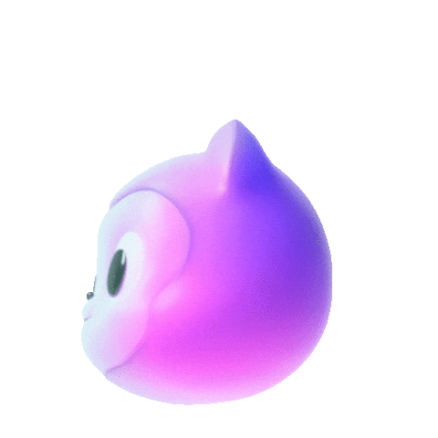
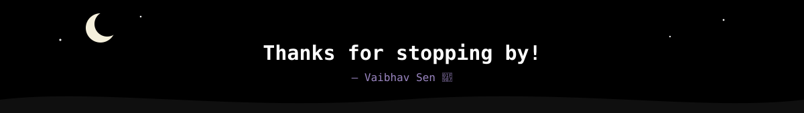

  

 

## About 

- 🌙 Turning 3am ideas into real apps.
- 🐍 Started with Python automation & CV projects (👁️ drowsiness detection, 🔳 QR tools, 🔊 TTS).
- 🌐 Now mostly living in TypeScript/React + Firebase land.
- 📚 Learning in public — check out my [Python roadmap repo](https://github.com/vabxsen/Advanced-Python-Roadmap-by-vabxsen) 🗺️.
- ☕ Fueled by late nights and too much coffee.

 

## Tech Stack 

  

 

 

## GitHub Stats 

 

## Contribution Snake 

<picture>
  <source media="(prefers-color-scheme: dark)" srcset="https://raw.githubusercontent.com/vabxsen/vabxsen/output/github-contribution-grid-snake-dark.svg" />
  <source media="(prefers-color-scheme: light)" srcset="https://raw.githubusercontent.com/vabxsen/vabxsen/output/github-contribution-grid-snake.svg" />
  
</picture>

 

 

## Get in touch 

  

  

  

  

 

   

