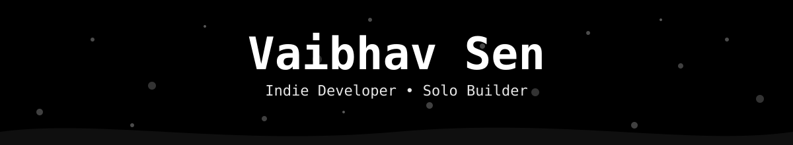

  

 

## About

- 🛠️ Building small, sharp apps solo — currently deep in **Slip** 📱, **Doclee** 📄, **Nexrig** ⚙️, **PricePilot** 💸 and **Dailynx** 🗓️
- 🐍 Started with Python automation & CV projects (👁️ drowsiness detection, 🔳 QR tools, 🔊 TTS)
- 🌐 Now mostly living in TypeScript/React + Firebase land
- 📚 Learning in public — check out my [Python roadmap repo](https://github.com/vabxsen/Advanced-Python-Roadmap-by-vabxsen) 🗺️
- ☕ Fueled by late nights and too much coffee

 

## Tech Stack

 

## GitHub Stats

<table width="100%">
  <tr>
    <td width="50%"></td>
    <td width="50%"></td>
  </tr>
</table>

 

## Achievements

 

## Contribution Snake

<picture>
  <source media="(prefers-color-scheme: dark)" srcset="https://raw.githubusercontent.com/vabxsen/vabxsen/output/github-contribution-grid-snake-dark.svg" />
  <source media="(prefers-color-scheme: light)" srcset="https://raw.githubusercontent.com/vabxsen/vabxsen/output/github-contribution-grid-snake.svg" />
  
</picture>

 

## Get in touch

  

 
