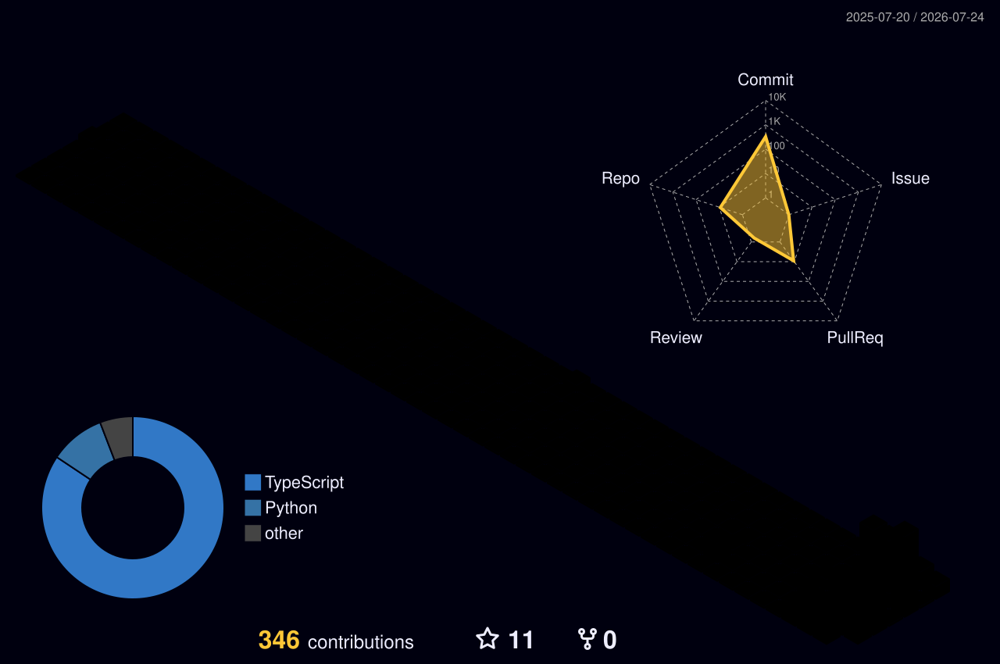

 

## About

- Building small, sharp apps solo — currently deep in **Slip**, **Doclee**, **Nexrig**, **PricePilot** and **Dailynx**
- Started with Python automation & CV projects (drowsiness detection, QR tools, TTS)
- Now mostly living in TypeScript/React + Firebase land
- Learning in public — check out my [Python roadmap repo](https://github.com/vabxsen/Advanced-Python-Roadmap-by-vabxsen)

 

## Tech Stack

 

## Metrics Dashboard

<!-- Generated by .github/workflows/metrics.yml (lowlighter/metrics), committed to assets/metrics.svg.
     Renders once that workflow has run at least once — see repo setup notes. -->

 

## 3D Contribution Skyline

<!-- Generated by .github/workflows/skyline.yml (yoshi389111/github-profile-3d-contrib),
     committed to profile-3d-contrib/. Renders once that workflow has run at least once. -->

 

## Connect

<!-- Add more badges here, e.g. LinkedIn / email / portfolio, once you have links for them -->

 

vabxsen

